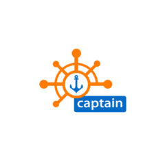
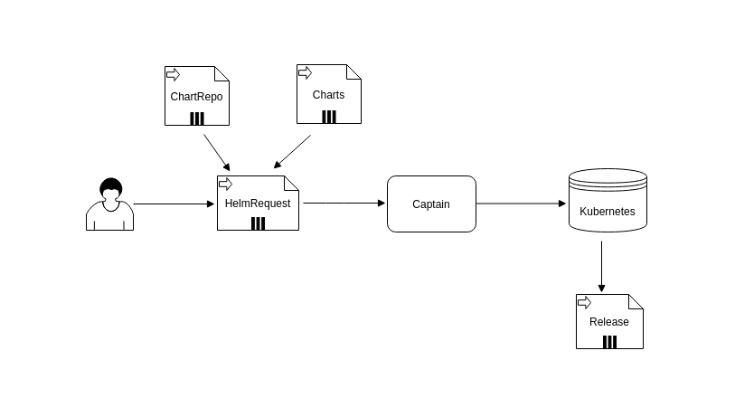

# Captain

[](https://opensource.org/licenses/Apache-2.0)
[](https://goreportcard.com/report/github.com/alauda/captain) [](https://img.shields.io/github/tag/alauda/captain)


Captain is a Helm 3 Controller





## About Helm3 

The [Helm 3 Design Proposal](https://github.com/helm/community/blob/master/helm-v3/000-helm-v3.md) exists for a while and currently it is still under heavy development. Captain comes as the first implementation of Helm v3 Controller based on the Proposal.

This project is based on the core [helm](https://github.com/helm/helm) v3 code, acting as a library. Since it's not officially 
released yet (alpha stage for now), some modifications were made to help implement this controller on a fork: [alauda/helm](https://github.com/alauda/helm) (will be deprecated once Helm's library is released).

## Features
* HelmRequest/ChartRepo/Release CRD, namespace based
* Git/Svn as ChartRepo
* Local ChartRepo based on ChartMuseum
* Multi cluster support based on [cluster-registry](https://github.com/kubernetes/cluster-registry)
* Dependency check for HelmRequest (between HelmRequests)
* `valuesFrom` support: support to ConfigMap or Secret value store
* `kubectl apply` like resource manipulation: no more resource conflict and CRD management issues


## Quick Start
Check the [Installation Guide](./docs/en/install.md) to learn how to install captain

Then, create a HelmRequest resource 

```yaml
kind: HelmRequest
apiVersion: app.alauda.io/v1alpha1
metadata:
  name: nginx-ingress
spec:
  chart: stable/nginx-ingress
```
After a few seconds, you have an nginx-ingress chart running

```bash
root@VM-16-12-ubuntu:~/demo# kubectl get pods
NAME                                             READY   STATUS    RESTARTS   AGE
nginx-ingress-controller-57987f445c-9rhv5        1/1     Running   0          16s
nginx-ingress-default-backend-7679dbd5c9-wkkss   1/1     Running   0          16s
root@VM-16-12-ubuntu:~/demo# kubectl get hr
NAME            CHART                  VERSION   NAMESPACE   ALLCLUSTER   PHASE    AGE
nginx-ingress   stable/nginx-ingress             default                  Synced   23s
```

For the detailed explain and advanced usage, please check the documentation below


## Documention

* [How captain works](./docs/en/captain.md)
* [Captain Upgrade](./docs/en/upgrade.md)
* [CRDs explain](./docs/en/crd.md)
* [Multi-Cluster Support](./docs/en/multi-cluster.md)
* [Git/SVN as ChartRepo](./docs/en/vcs-repo.md)
* [Annotations](./docs/en/ano.md)
* [ARM64 Support](./docs/en/arm64.md)
* [FAQ](./docs/en/faq.md)

## SDK
* [Golang](https://github.com/alauda/helm-crds): also contains the CRD definition

## Future Plans
* Java SDK
* Auto update of HelmRequest
* Always update to the latest version of chart


## Captain Releated Projects
* [kubectl-captain](https://github.com/alauda/kubectl-captain): a kubectl plugin for captain
* [captain-test-charts](https://github.com/alauda/captain-test-charts): test charts for captain
* [oci-chartrepo](https://github.com/alauda/oci-chartrepo): use oci registry as helm chart repo

## Related Projects

* [flux](https://github.com/fluxcd/flux): flux have a similar controller based on Helm2


